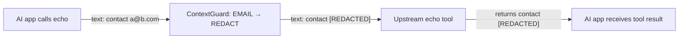
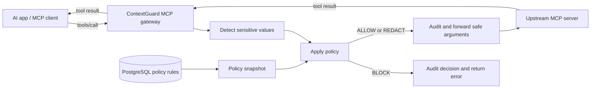

# ContextGuard

**ContextGuard helps control what an AI app sends to a selected MCP tool server.**

## Overview

An AI app can call tools that send data to services outside an organization's intended boundary. A search query, ticket, or other tool argument could contain a customer's email address or a credential. ContextGuard sits between the MCP caller and a selected upstream tool server, where it can check those outgoing arguments before the server receives them.

The gateway detects selected sensitive values, applies PostgreSQL-backed rules to allow, redact, or block the call, and records decision metadata without storing the original arguments in its audit table. It demonstrates a policy boundary that an organization could adapt to its own tools, data, and handling rules. The included rules are examples: the simulated `internal_note` tool may receive an email, while other demo tools receive a redacted value. Today, ContextGuard protects **tool-call arguments sent to one configured upstream**; support for multiple destinations is a [next step](#current-scope-and-next-steps).

## Demo

The repository includes a separate MCP server with `echo`, `uppercase`, and a simulated approved `internal_note` tool. The [verification script](scripts/verify-gateway.ps1) connects to ContextGuard as an MCP client and calls all three tools.

Here is the email-redaction scenario. The verification script stands in for an AI app: ContextGuard receives the **tool-call argument**, applies the email rule, and sends only the redacted value to the upstream tool.


```mermaid
flowchart LR
    Caller["AI app calls echo"] -->|"text: contact a@b.com"| Guard["ContextGuard: EMAIL → REDACT"]
    Guard -->|"text: contact [REDACTED]"| Echo["Upstream echo tool"]
    Echo -->|"returns contact [REDACTED]"| Result["AI app receives tool result"]
```

The AI app's full prompt does not necessarily pass through ContextGuard; this gateway inspects the arguments sent in MCP `tools/call` requests.

```text
PASS: gateway lists echo, uppercase, and internal_note
PASS: plain echo reaches upstream
PASS: email is redacted before echo
PASS: approved internal tool receives the email
PASS: second tool uses the same guard
PASS: payment card is redacted
PASS: token is blocked
PASS: approved internal tool still blocks a token
```

The email and card examples use synthetic values. The token example produces an MCP tool error without calling the upstream tool. After [starting the services](#getting-started), run the script yourself and inspect the audit records:

```powershell
.\scripts\verify-gateway.ps1 -GatewayUrl http://127.0.0.1:18080/mcp
```

```cmd
docker compose exec postgres psql -U contextguard -d contextguard -c "SELECT tool_name, outcome, detection_count, snapshot_version FROM policy_audit_events ORDER BY id DESC LIMIT 6;"
```

The audit rows contain decision metadata, not the email, payment-card number, token, or full tool arguments.

## Capabilities

- Discovers the tools and schemas of one configured Streamable HTTP MCP upstream when ContextGuard starts, then exposes those tools through guarded handlers.
- Checks strings and nested tool arguments for email addresses, Philippine mobile numbers, payment-card candidates, authentication tokens, and sensitive JSON fields.
- Applies a tool-specific rule when present, otherwise the detection-type default. Across multiple detections, `BLOCK` takes priority over `REDACT`, then `ALLOW`. A detected type without an applicable rule is blocked.
- Builds a separate sanitized argument structure for redacted calls, preserving the caller's original arguments.
- Writes an audit record before forwarding. If the decision cannot be processed or audited safely, the call is not forwarded.

The included migrations seed **example policy rules**, not a universal policy:

| Detection | Example decision |
| --- | --- |
| Email address | `REDACT` |
| Philippine mobile number | `REDACT` |
| Payment-card candidate | `REDACT` |
| Authentication token | `BLOCK` |
| Sensitive JSON field | `BLOCK` |

One additional example rule overrides `EMAIL` to `ALLOW` for `internal_note` only. The other tools still use the default `EMAIL → REDACT` rule. The `internal_note` tool returns text without storing it; it simulates an approved destination rather than connecting to a real internal system.

## How it works


```mermaid
flowchart LR
    Caller["AI app / MCP client"] -->|"tools/call"| Gateway["ContextGuard MCP gateway"]
    Gateway --> Detect["Detect sensitive values"]
    Detect --> Decide["Apply policy"]
    Rules[(PostgreSQL policy rules)] --> Snapshot["Policy snapshot"]
    Snapshot --> Decide
    Decide -->|"BLOCK"| Stop["Audit decision and return error"]
    Decide -->|"ALLOW or REDACT"| Forward["Audit and forward safe arguments"]
    Forward --> Upstream["Upstream MCP server"]
    Upstream -->|"tool result"| Gateway
    Gateway -->|"tool result"| Caller
```

ContextGuard is one Spring Boot gateway organized into focused packages for MCP integration, detection, policy evaluation, redaction, and persistence. The demo upstream is a separate application. Spring AI handles the MCP client and server connections; a ContextGuard-owned service controls each `tools/call` before the upstream client can invoke it. Flyway creates the database schema, JPA loads the rules, and the application evaluates calls against an immutable in-memory policy snapshot. An explicit refresh service can replace that snapshot, but there is currently no administration endpoint for it.

## Tech Stack

| Technology | Role |
| --- | --- |
| Java 21 | Application language |
| Spring Boot 4.1.1 and Spring WebMVC | Application runtime and HTTP server |
| Spring AI 2.0.1 and MCP Streamable HTTP | MCP server and client integration |
| PostgreSQL 17 | Policy rules and audit metadata |
| Spring Data JPA | Database entities and repositories |
| Flyway | Versioned schema and example-rule migrations |
| Docker Compose | Runs PostgreSQL, the demo upstream, and the gateway locally |
| Maven Wrapper and JUnit | Reproducible builds and automated tests |

## Testing

| Check | Evidence |
| --- | --- |
| Detection and policy decisions | Unit tests cover detectors, tool-specific overrides, precedence, missing rules, and snapshots. |
| Redaction | Unit tests cover nested arguments, overlapping text ranges, and preservation of original input. |
| Database wiring | Application tests load seeded rules and verify metadata-only audit persistence. |
| Real MCP calls | `scripts/verify-gateway.ps1` checks tool discovery, ordinary forwarding, tool-specific email handling, redaction, and blocking. |

With PostgreSQL running and `SPRING_DATASOURCE_PASSWORD` set in the same Command Prompt terminal, run the gateway tests from the repository root:

```cmd
mvnw.cmd test
```

The demo upstream has its own test suite:

```cmd
cd demoupstream
mvnw.cmd test
```

## What I learned

### MCP and integration

- **MCP client and server roles:** An application can expose tools to a caller while acting as a client to another MCP server. ContextGuard uses both roles to sit between them.
- **Tool discovery and calls:** I worked with initialization, `tools/list`, and `tools/call`, and learned why the gateway needs its own guarded handlers instead of automatically re-exposing upstream tools.

### Privacy logic

- **Detection, decision, and action are separate steps:** Finding sensitive data does not decide the response by itself. Policy selects `ALLOW`, `REDACT`, or `BLOCK`, with blocking taking priority.
- **Safe redaction and checksums:** The Luhn checksum helps reduce false payment-card matches; it does not prove that a card exists. I also learned to merge overlapping text ranges and replace from right to left so earlier character positions remain valid.

### Database and operations

- **Flyway and JPA have different jobs:** Flyway versions schema and example-rule changes. JPA maps the resulting tables to entities and repositories for application access.
- **Repeatable local setup:** Docker Compose starts the database and both MCP applications with a known configuration. Audit records capture decisions without keeping the sensitive argument values.

### Engineering workflow

- **Testing at different levels:** Unit tests check detectors and policy behavior, application tests check Spring and database wiring, and the verification script exercises real MCP calls through the gateway.
- **Recording decisions and changes:** Architecture decision records explain choices such as explicit tool forwarding and immutable snapshots. Focused commits make each change easier to review.

## Current scope and next steps

ContextGuard currently uses one configured upstream, discovers tools at startup, and checks tool-call arguments. Rules can vary by tool name and detection type, with detection-type defaults for other tools; they cannot yet distinguish multiple upstream destinations or authenticated caller roles. It does not inspect upstream responses. The Compose demo publishes the gateway and database only on the host's loopback address and keeps the upstream on the private Compose network. It does not provide gateway authentication, TLS termination, or an operator interface for policy changes. Treat it as a working prototype rather than a production security boundary.

| Next step | Why it matters |
| --- | --- |
| Multiple upstream destinations and destination policies | Allows an approved internal service and an external service to have distinct connections and trust boundaries. |
| Authentication and transport security | Required before exposing the gateway beyond a trusted local environment. |
| Broader end-to-end coverage | Exercises more policy decisions and failure paths through a real upstream in CI. |
| Policy administration and controlled refresh | Lets operators change rules without manual database edits or a restart. |
| Broader upstream support and catalog refresh | Allows more integrations and tool-list changes while the gateway is running. |
| Response inspection | Extends protection to sensitive data returned by upstream tools. |

## Getting started

The quickest local demo uses Docker Desktop and Windows PowerShell. Run these commands from the repository root. Docker Compose builds and starts PostgreSQL, the demo upstream, and ContextGuard; Java and Maven do not need to be installed on your computer for this path.

1. Copy `.env.example` to `.env` and replace the placeholder with a unique local password:

   ```cmd
   copy .env.example .env
   ```

   `.env` is ignored by Git. Compose passes this password to PostgreSQL and ContextGuard. If you already initialized the PostgreSQL volume, use its existing password; changing `.env` alone does not change the database user's password.

2. Build and start all three services, then wait until each reports `healthy`:

   ```cmd
   docker compose up --build -d
   docker compose ps
   ```

3. In Windows PowerShell, run the verification script. Expect eight `PASS` lines:

   ```powershell
   .\scripts\verify-gateway.ps1 -GatewayUrl http://127.0.0.1:18080/mcp
   ```

   If PowerShell blocks scripts, `Set-ExecutionPolicy -Scope Process Bypass` changes the setting only for that PowerShell session. To see startup or error logs, use `docker compose logs contextguard demoupstream postgres`. Stop the demo with `docker compose down`; this keeps the PostgreSQL data volume.

### Run the Java applications locally

If you prefer IntelliJ or Maven, keep PostgreSQL in Compose and run the two applications on your computer. Stop any Compose app containers first with `docker compose stop contextguard demoupstream` so port `18080` is free. This route needs Java 21; the included Maven wrappers do not require a system-wide Maven installation.

1. Start PostgreSQL with `docker compose up -d postgres` and wait for it to be healthy in `docker compose ps`.

2. In a Command Prompt terminal, start the demo upstream:

   ```cmd
   cd demoupstream
   mvnw.cmd spring-boot:run -Dspring-boot.run.arguments=--server.port=18081
   ```

3. In another Command Prompt terminal at the repository root, start ContextGuard using the same password as the PostgreSQL volume:

   ```cmd
   set "SPRING_DATASOURCE_PASSWORD=your-local-database-password"
   set "CONTEXTGUARD_UPSTREAM_URL=http://127.0.0.1:18081"
   mvnw.cmd spring-boot:run -Dspring-boot.run.arguments=--server.port=18080
   ```

   Wait for `Tomcat started on port 18080`. ContextGuard discovers upstream tools during startup, so start the upstream first. Flyway applies pending migrations as ContextGuard connects to PostgreSQL. You can then run the same PowerShell verification script shown above.

To use another Streamable HTTP MCP server, set `CONTEXTGUARD_UPSTREAM_URL` to its base URL before starting ContextGuard. For Compose, change the `contextguard` service environment in `compose.yaml`; `localhost` inside that container refers to the container itself. The endpoint path defaults to `/mcp` and can be changed with `CONTEXTGUARD_UPSTREAM_ENDPOINT`. Restart ContextGuard when the upstream's tool list changes. The configured upstream must be reachable when ContextGuard starts.

## Architecture decisions

- [ADR 0001: Technology baseline](docs/adr/0001-technology-baseline.md)
- [ADR 0002: Controlled MCP tool forwarding](docs/adr/0002-controlled-mcp-tool-forwarding.md)
- [ADR 0003: Policy evaluation and safe redaction](docs/adr/0003-policy-evaluation-and-redaction.md)
- [ADR 0004: Tool-specific policy rules](docs/adr/0004-tool-specific-policy-rules.md)
